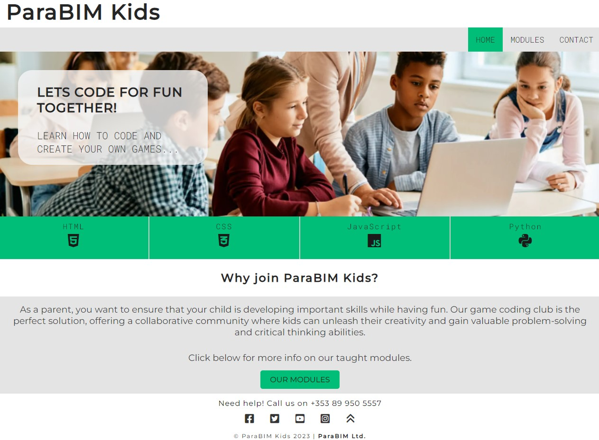

# Kids Coding Club

## A fictional website built for an after school kids coding club in Dublin, Ireland

### PP1 Jalal Semaan

## **[Live site](https://jjsemaan.github.io/paraBIMkidsProject/)**

------------------------------------------------------------------

## **[Repository](https://github.com/jjsemaan/paraBIMkidsProject/tree/main)**

------------------------------------------------------------------

## Features

### Desktop and Mobile Devices

* Navigation Menu
  * Contains links to the Home, Modules and Contact pages and will be responsive on all devices in two forms straight horizontal menu and burger menu for mobile devices.
  * This will allow users to navigate intuitively between the pages without any interruptions on any size device.
  * See below images of navigation menu.

* Footer
  * Allows site visitors to make a quick enquiry call, access further club info on social media and link to the website developers.
    1. A quick Call Us telephone link that opens up the default calling software on the active device.
    2. Social media icons that link to the club's pages on facebook, twitter, youtube and instagram.
    3. Scroll-to-top button.
    4. Copyright info with link to the developer's website.

* Favicon
  * This will appear site-wide on the top left corner of the website tab in any browser to enable easy identification especially when multiple tabs are open.

* 404 Page
  * The 404 page will appear if a site visitor enters a broken link.
  * This page includes a home button that will take the visitor back to the home page.
  * The footer remains enabled in the 404 page with the telephone link for further assistance.

### Home

* Home Page
  * This page opens up with an image of kids sat in a classroom with a laptop to resemble a collaborative coding experience.
  * Below the image is a ribbon that displays taught coding languages and their corresponding industry icons.
  * Below the ribbon a brief note is provided to explain the club ethos and a button that takes the site visitor to the modules page.

### Modules

* Modules Page
  * This page provides info on coding languages regarded as separate learning modules and an enroll button for each module.
  * The enroll button directs the site visitor to a contact form.
  * A reading list gallery is located below the modules which includes images of recommended books with links links to their seller.

### Contact

* Contact Page
  * This page provides a contact form and a google maps location allowing site visitors to reach out to the club with any queries.
  * Contact form includes the following fields:
    * First Name - (required - type=text)
    * Last Name - (required - type=email)
    * email - (required - type=email)
    * phone - (required - type=tel)
    * message - (required - type=textarea)
  * Once all required fields are completed and the form is submitted, a popup with an 'Ok' button will appear informing that someone will get in touch the soonest possible. When clicked, the 'ok' button will hide the popup and reset the form.
  * The google maps location provides the accurate loction and of the club.

## Existing Features

* Website is fully responsive and works of all devices.
* The main image inthe home page is implemented in two versions, a wider version for screen width 800px and over and a square   version of the same image for screen widths less than 800px.
* The responsive slogan 'Lets code for fun together!' is responsive and disaapears when the burger menu is clicked to make space for the menu items.
* The active page remains displayed beside the burger menu to keep site visitors aware of the current active page.
* The coding languages ribbon wraps up into two columns in smaller screens to maintain its visibility.
* The modules on the modules page are responsive and can wrap up to a single column appearing on top of one another in smaller screens.
* The books gallery is responsive and can wrap up to a single column with book covers appearing on top of one another in smaller screens.

## Features Left to Implement

* CSS framework to used in order to improve performance affecting Large Cummulative Layout Shifts CLS.
* An application form for each module could be added to make queries more specific.
* More info can be added about after school locations and availability and reservations.
* Instructors' biographies can be added on a separate page.
* A future addition should include resoures and sample gaming codes developed by students.
* A login feature should be added for students to access resources.

## Technology

> HTML (Hyper Text Markup Language)   Used for creating the structure and content of web pages, providing a framework for organising code for a website.

> CSS (Cascading Style Sheets)   Commonly used to define the visual appearance and layout of web pages, including colors, fonts, spacing, and positioning.
  
> JavaScript   A versatile programming language that adds interactivity and dynamic functionality to websites.

> IDE Codeanywhere (Integrated Development Environment)   An online IDE that allows developers to code, collaborate, and deploy their projects provided an internet connection.

> Git   A version control system that provides both a command-line interface (CLI) and a graphical user interface (GUI) for managing and interacting with repositories.
> Font Awesome   A popular icon library and toolkit that provides a wide range of scalable vector icons that can be easily customised and used in web development projects.

> Google Maps API   A tool that allows developers to integrate interactive google maps into their applications.

> Microsoft Designer   A user interface design tool that helps create visually appealing and intuitive images and photos.

##Testing

> Testing was performed on two main browsers Microsoft Edge and Google Chrome

### Testing Phase

**Testing for links and Form**
| Test |Outcome  |
|--|--|
|All links on horizontal navigation menu lead to their correct pages| Pass  |
|All links on burger menu lead to their correct pages| Pass  |
|Modules button leads to modules page| Pass
|Contact button leads to contact form on contact us page| Pass
|Footer social links all lead to their respective social media sites |Pass|
|Contact form submits when all criteria is filled correctly| Pass  |
|Contact button leads to contact form on contact us page| Pass
|Popup window resets the form post submission| Pass|
|Form Validation presents when incorrect input type is entered |Pass|

**Testing for responsiveness**
| Test |Outcome  |
|--|--|
|Home page, about, portfolio, contact us displays correctly on screens larger than 950px|Pass |
|Home page, about, portfolio, contact us displays correctly on screens smaller than 950px |Pass  
